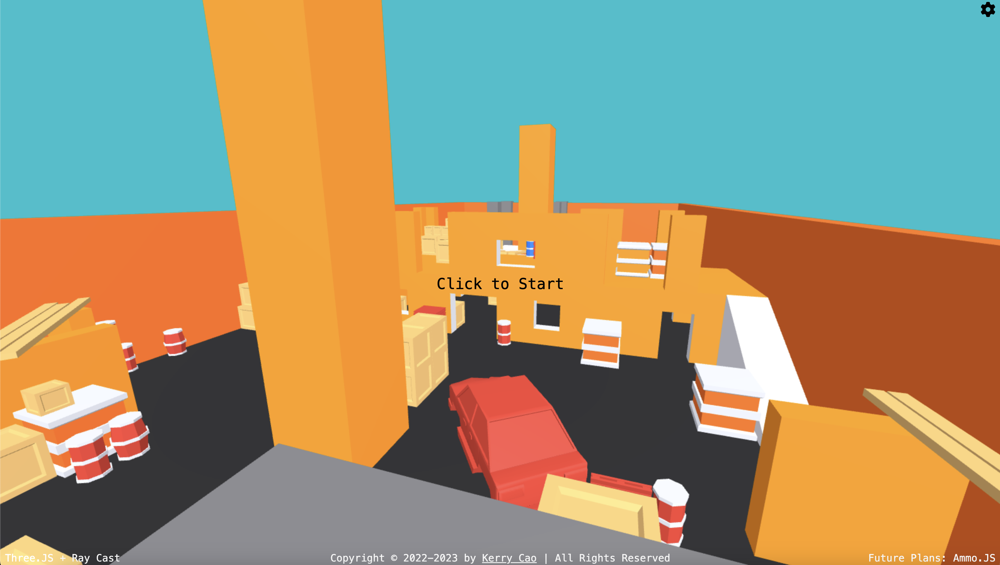

# parkour 

## [DEMO](https://cdn.kerrycao.com/side-projects/parkour/)

## Description
Parkour is a cool Three.JS learner project that allows players to run around and explore a virtual parkour map. 

## Game Goal
The goal of the game is to navigate the map as quickly and as creatively as possible. Players can experiment with different paths and techniques to achieve the fastest times or perform impressive stunts.

## Collision Detection
Collision detection in the game is currently implemented using ray casting. Six rays cover different directions: front, back, left, right, up, and down. While the current system is functional, it is not perfect and clippings can occur at odd angles. When a collision occurs on the horizontal plane, all horizontal momentum is cleared, which may feel unnatural to players. Additionally, the current system does not work well with ramps. Running up a moderately sloped ramp is acheived using a constant upward boost when grounded. However, this method breaks when the slope of the ramp is too steep, resulting in the player clipping into the ramp. The constant upward boost does create a nice running animation, I was pleasantly surprized. 

## Movement
Movement in the game is based on a momentum system, similar to the mechanics in Titanfall 1 (without the double jump). Each jump adds a forward speed boost, allowing players to perform bunny hopping if timed correctly. This momentum-based movement system adds a level of fluidity and speed to the player's movements.

## Future Improvements
In the future, the project plans to incorporate Ammo.js, an actual physics engine, to add more realistic physics to the game. This improvement will enhance the overall gameplay experience, allowing for more dynamic interactions and realistic movements within the game world.
